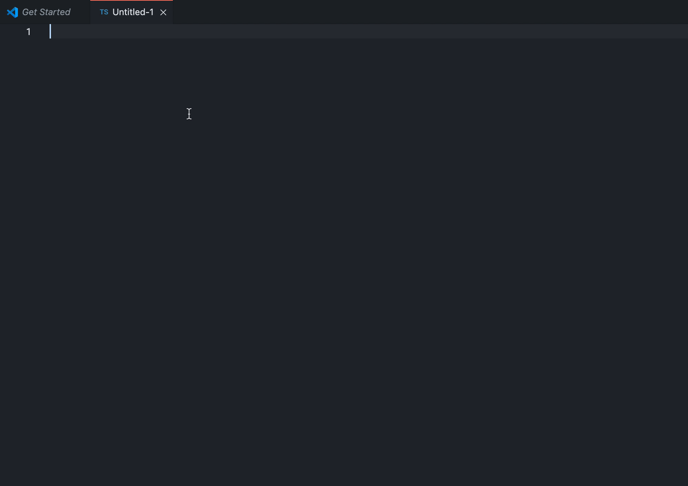
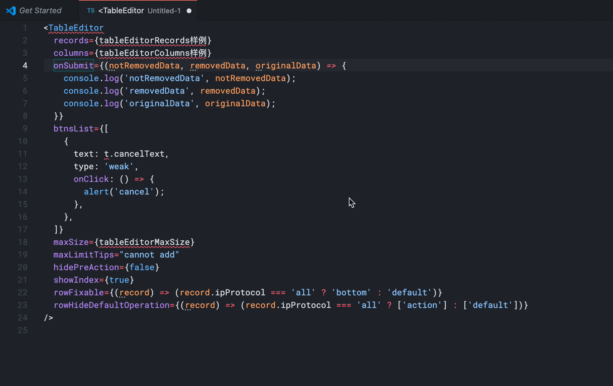

## 简介

Tce component 的代码片段

## 使用方法

可以使用「tce-组件名」的方式来调用，例如：`tce-layout`

## 功能简介

- 输入简短的几个字符，就可以生成组件的代码片段
  
- 鼠标移至部分属性或变量上，会有相关的简介
  
- 鼠标移至样例，会看到具体的代码，可以复制
  
- 如有需要，还可以查看详情
  

## 支持的 TCE 组件

- ConfirmModal
- Detail
- Form
- GroupTitle
- Layout
- LocalConfirm
- Selector
- Step
- TableEditor
- TablePage

## 支持 React Hooks

| 快捷键   | Hook        |
| ----- | ----------- |
| `us`  | useState    |
| `ue`  | useEffect   |
| `uct` | useContext  |
| `urd` | useReducer  |
| `ucb` | useCallback |
| `um`  | useMemo     |
| `ur`  | useRef      |